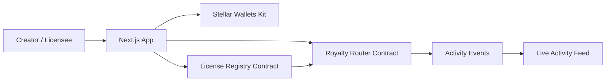
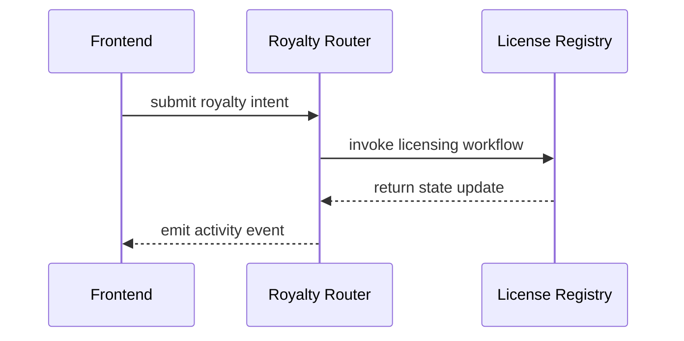

# Stellar License OS

## Product overview
Stellar License OS is a digital asset licensing platform for creators and businesses that want to monetize, protect, and distribute intellectual property and digital tokens with transparent on-chain workflows.

## Problem statement
Creators often rely on fragmented licensing tools, manual royalty tracking, and opaque approval flows. Stellar License OS consolidates licensing, wallet interactions, activity tracking, and transaction monitoring into a production-style operating layer on Stellar.

## Architecture diagram


## Smart contract design
- License Registry: creates licenses, tracks state transitions, stores creator-owned license records, and exposes upgrade hooks.
- Royalty Router: handles royalty routing intents and demonstrates inter-contract design patterns.

## Inter-contract communication flow


## Features
- Landing, dashboard, activity, transaction center, analytics, and settings pages
- Wallet connection and network switching primitives
- Transaction lifecycle states with explorer links and retry actions
- Live activity feed and observable event emissions

## Tech stack
- Next.js 15 + TypeScript + Tailwind CSS
- Zustand + React Query
- Stellar Wallets Kit + Stellar SDK
- Soroban smart contracts
- Vitest + Testing Library

## Local development
```bash
git clone <repo-url>
cd knm
npm install
cp .env.example .env.local
npm run dev
```

## Environment variables
- NEXT_PUBLIC_HORIZON_URL
- NEXT_PUBLIC_NETWORK
- NEXT_PUBLIC_CONTRACT_REGISTRY
- NEXT_PUBLIC_CONTRACT_ROUTER
- NEXT_PUBLIC_SENTRY_DSN
- NEXT_PUBLIC_POSTHOG_KEY

## Testing
```bash
npm run test
```

## CI/CD
GitHub Actions workflows are included for pull request checks and deployment on merge to main.

## Deployment
See the deployment scripts in the scripts directory.

## Security considerations
- Use authenticated contract entry points.
- Validate all input values.
- Keep private keys off-chain.
- Review contract upgrades before applying them.

## Screenshots
- Add screenshots in docs/screenshots after running the app locally.

## Contract addresses
- Registry: TBD
- Router: TBD
- Last tx: TBD
- Explorer: TBD

## Demo placeholders
- Demo URL: TBD
- Demo wallet: TBD
##Transaction id:faeeb9aee3659ad98259c461f7265c1d8ec0ebc84740083e12b91e5e1c031352


  Screenshot:
  

  #screenshots :
  
  

