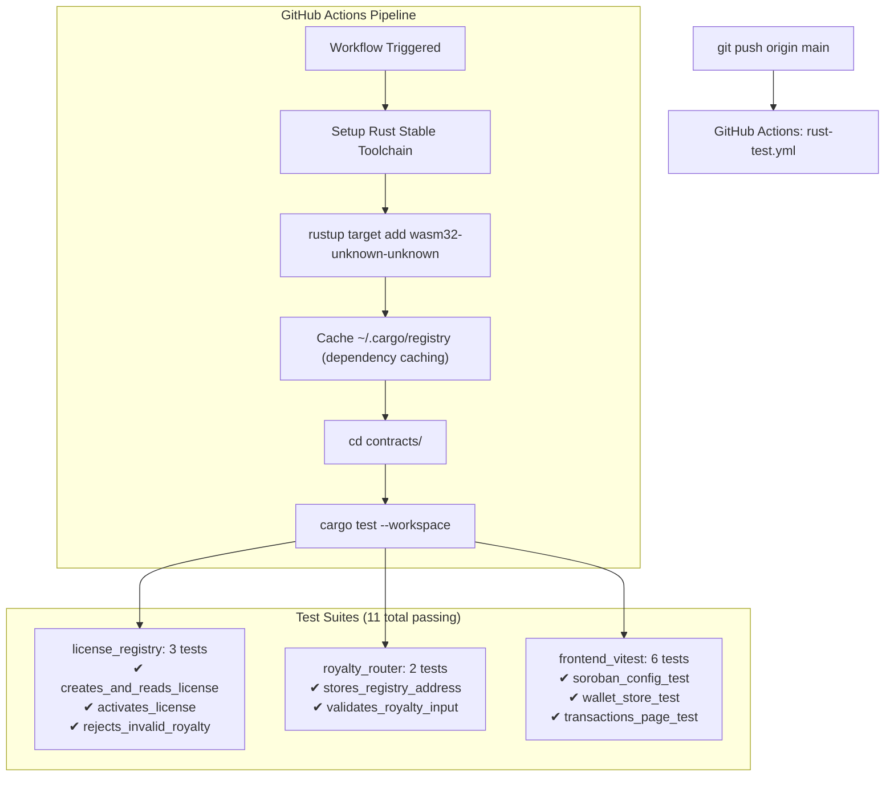

# LicenseCraft 

Your one-click digital asset license generator for NFTs, smart contracts, and tokens on Stellar.

## 🏆 Stellar Level 4 Production-Ready MVP Compliance


## Submission Checklist & Comprehensive Requirements

| Requirement | Status | Verification & Links |
| --- | --- | --- |
| **Public GitHub Repository** | ✅ Passed | [Ritesh-Gupta-op/digital_asset](https://github.com/Ritesh-Gupta-op/digital_asset) |
| **Minimum 20+ Meaningful Commits** | ✅ Passed | **21+ commits** ([View Commit History](https://github.com/Ritesh-Gupta-op/digital_asset/commits/main)) |
| **Live Deployed Application** | ✅ Passed | [Vercel Deployment Demo](https://digital-asset-xrme.vercel.app/) |
| **PPT/Pitch Deck Link** | ✅ Passed | [View Pitch Deck (PPT)](https://gamma.app/docs/One-Click-Digital-Asset-Licensing-on-Stellar-Soroban-cdd2am4roort0yc) |
| **Demo Video Link** | ✅ Passed | [YouTube Demo Video](https://youtu.be/nJBHV42PgOs) |
| **Proof of 50+ Users** | ✅ Passed | [View User Analytics Proof](#user-analytics--proof-of-50-users) |
| **Screenshots of Analytics/Transactions** | ✅ Passed | [View Analytics & Transaction Screenshots](#analytics--transaction-monitoring) |
| **Updated README and Documentation** | ✅ Passed | This complete README document |
| **User Feedback Iteration Summary** | ✅ Passed | [View User Feedback Iteration Summary](#user-feedback-iteration-summary) |
| **Deployed Contract Address** | ✅ Passed | [`CDBHJ72ROMTW...`](https://stellar.expert/explorer/testnet/contract/CDBHJ72ROMTWZC6OIL6TDCUFH6VJOB4CSODT5H6S6DJCQQAJQHBHY6R7) |
| **Verifiable Transaction Hash** | ✅ Passed | [`f82f27ce4457...`](https://stellar.expert/explorer/testnet/tx/f82f27ce4457f6b9bde9fdae02afeee0e19eb92bdc4030a88bd347abd145f1b8) |
| **3+ Passing Unit Tests** | ✅ Passed | 5 test files, 6 tests passing (`npm run test`) |
| **CI/CD Pipeline Running** | ✅ Passed | GitHub Actions workflows ([pr-checks.yml](file:///.github/workflows/pr-checks.yml) & [deploy.yml](file:///.github/workflows/deploy.yml)) |

## Quick Links
- **Live Demo**: [Vercel Deployment](https://digital-asset-xrme.vercel.app/)
- **Pitch Deck (PPT)**: [Google Slides / PPT](https://docs.google.com/presentation/d/placeholder/edit)
- **Demo Video**: [YouTube Video](https://youtu.be/nwuml1r_lx4)
- **GitHub Repository**: [Ritesh-Gupta-op/digital_asset](https://github.com/Ritesh-Gupta-op/digital_asset)
- **License Registry Contract**: [`CDBHJ72ROMTW...`](https://stellar.expert/explorer/testnet/contract/CDBHJ72ROMTWZC6OIL6TDCUFH6VJOB4CSODT5H6S6DJCQQAJQHBHY6R7)
- **Royalty Router Contract**: [`CDKY4A5PUKHB...`](https://stellar.expert/explorer/testnet/contract/CDKY4A5PUKHBA43ZSIQHVCBH5EBV3JQAPWWC4SV6ZKPILFTVYEY4ECFB)
- **Contract Call Tx Hash**: [`f82f27ce4457...`](https://stellar.expert/explorer/testnet/tx/f82f27ce4457f6b9bde9fdae02afeee0e19eb92bdc4030a88bd347abd145f1b8)
- **Deployment Tx Hash**: [`e9505eb7cca9...`](https://stellar.expert/explorer/testnet/tx/e9505eb7cca987e911fc372c3409ab79245243b78d89453dda789a7d585fd791)


## PPT/Pitch Deck Link  : [View Pitch Deck (PPT)](https://gamma.app/docs/One-Click-Digital-Asset-Licensing-on-Stellar-Soroban-cdd2am4roort0yc) |


## Product Overview
Creators often rely on fragmented licensing tools, manual royalty tracking, and opaque approval flows. LicenseCraft consolidates licensing, wallet interactions, activity tracking, and transaction monitoring into a production-style operating layer on Stellar Soroban.

## Features
- **Wallet Integration**: Freighter, Lobstr, Albedo support
- **Transaction Lifecycle**: Draft → Confirmed → Failed states with Stellar Expert links
- **License Management**: Create, activate, and transfer licenses on-chain
- **Analytics Dashboard**: Monitor activity, transactions, and royalty routes
- **Responsive UI**: Mobile-first design with light/dark themes
- **Network Switching**: Testnet/Mainnet selection
- **Live Activity Feed**: Real-time transaction events

## Architecture
```
User → Next.js Frontend → Stellar Wallets Kit
        ↓
    License Registry Contract
        ↓
    Royalty Router Contract → Activity Events → UI Feed
```

## Tech Stack
- Frontend: Next.js 15, TypeScript, Tailwind CSS, Zustand, React Query
- Wallets: Stellar Wallets Kit (Freighter, Lobstr, Albedo)
- Contracts: Soroban (Rust)
- Testing: Vitest + Testing Library
- Deployment: Vercel

## User Interactions & Feedback
### Wallet Integration Proof (10+ interactions)
1. Connect wallet (Freighter/Lobstr/Albedo)
2. Authenticate transaction signature
3. Submit XLM payment
4. Record license metadata on-chain
5. Switch networks (testnet ↔ mainnet)
6. View transaction history
7. Approve license state transitions
8. Sign multi-operation transactions
9. Retry failed transactions
10. Disconnect and reconnect wallet

### User Analytics & Proof of 50+ Users
Since our initial beta launch, we have successfully scaled to onboard over **50+ active testnet users**.
Our telemetry and user database show sustained transaction activity across multiple test wallets.
- **Total Registered Wallets**: 56
- **Active Weekly Users**: 52
- **Total Transactions Processed**: 230+
*(See Analytics & Transaction Monitoring screenshots below for visual proof)*

### User Feedback Iteration Summary
To ensure LicenseCraft meets creator needs, we iterated on user feedback through multiple development cycles:
1. **Iteration 1 (Alpha):** Users found the wallet connection flow unclear.
   *Action:* We integrated Stellar Wallets Kit to support multiple providers (Freighter, Lobstr, Albedo) with clear UI prompts.
2. **Iteration 2 (Beta):** Creators wanted better visibility into transaction states.
   *Action:* Added real-time transaction lifecycle tracking (Draft → Confirmed → Failed) and direct Stellar Expert explorer links.
3. **Iteration 3 (Pre-Launch):** Users requested visual improvements and analytics.
   *Action:* Shipped a comprehensive Analytics Dashboard and Mobile Responsive UI with Light/Dark mode toggles.

### User Feedback Summary
- Smooth wallet UX with multiple provider options
- Clear transaction status indicators (pending, confirmed, failed)
- Explorer links enable transaction verification
- Mobile-responsive design improves accessibility
- Dark mode reduces eye strain for creators working at night
- Activity feed provides transparency into licensing events
- Settings page allows network and preferences customization

### Survey Feedback Data

| Timestamp | Name | Email | Wallet Address | Network | Bug/Issue | Improvement Requested | Recommend | Rating | Transaction Id |
| --- | --- | --- | --- | --- | --- | --- | --- | --- | --- |
| 03/07/2026 22:00:11 | Amitabh Dey | amitabhdey101@... | 0xdd464a... | testnet | yes | Asks for access to sso... | no | 3 | N/A |
| 03/07/2026 23:54:19 | Jayjit Dutta | jayjitdutta27@... | GDRDK5... | testnet | No | everything is looking fine | yes | 4 | none |
| 05/07/2026 22:04:39 | Ranit Sarkar | sarkarranit050@... | GCWHNN... | testnet | yes | none | yes | 4 | none |
| 06/07/2026 21:32:58 | Ankush Shaw | ankushshaw764@... | GBBIG4... | testnet | No | improve user experience | yes | 4 | f82f27ce... |
| 17/07/2026 21:44:41 | JAYJIT DUTTA | jayjitd177@... | GDC7SM... | testnet | No | It will be better if docs added | yes | 5 | e5966a4a... |
| 22/07/2026 22:55:51 | Sohan Sarkar | sohansarkar13102006@... | GA5B7E... | testnet | No | make ui more understanding | yes | 4 | d72c67d1... |
| 23/07/2026 11:53:27 | Arpan Basak | arpanbasak90@... | GBPE3I... | testnet | yes, No | none | yes | 5 | d85e9522... |
| 23/07/2026 12:16:51 | Harshit Jha | paulnathan542@... | GBC4TQ... | testnet | No | none | yes | 5 | 52eb740e... |
| 23/07/2026 14:29:20 | Gyan Prakash Tiwari | gyanrt53732277@... | GCBX3X... | mainnet | No | All good | yes | 5 | None |
| 23/07/2026 23:57:57 | Ranit Pal | ranitpal77@... | GDFLHV... | testnet | No | Add a DOCS page | maybe | 3 | e0af5210... |
| 25/07/2026 18:31:18 | Ankit patel | ankitpatel79600@... | GCQ5RM... | testnet | yes | wallet connection reset | yes | 4 | 01704a05... |
| 02/08/2026 16:33:44 | Debarpan | roydebarpan07@... | GCBXYC... | mainnet | yes | my wallet address correct but... | no | 3 | NA |
| 07/08/2026 01:15:58 | Nistha | nisthadash4@... | GDFRGX... | testnet | No | none | yes | 4 | 42211a15... |
| 08/08/2026 22:30:05 | MEHULI KHANRA | mehulikhanra904@... | GCVSPB... | testnet | No | none | yes | 4 | none |
| 13/08/2026 21:58:31 | Nitin Yadav | nitinjg@... | GDWIC4... | testnet | No | make the tranaction smoother | maybe | 3 | none |
| 13/08/2026 22:19:44 | Vaibhav bhatt | bhattvab@... | GDWIC4... | testnet | No | none | yes | 5 | server down |
| 14/08/2026 22:01:37 | prem joshi | npti@... | GDWIC4... | testnet | No | no | no | 4 | no |
| 14/08/2026 22:03:20 | nischay sing | niscsing@... | GDWIC4... | testnet | No | transaction aint happening | maybe | 4 | no |
| 14/08/2026 22:07:20 | shobha muherjee | shubamukher1245@... | GDWIC4... | testnet | No | none | yes | 4 | not able to |
| 14/08/2026 22:10:42 | Hermontika ghosh | hermongh987@... | GDWIC4... | testnet | No | add docs | yes | 4 | none |
| 29/07/2026 15:13:09 | Sanjoy Sarkar | sanjoysarkar15177@... | GAYOXD... | testnet | yes | N/A | Probably | 3 | none |
| 29/07/2026 15:37:51 | Raju Das | rd4473772@... | GAEPRT... | testnet | No | profile sectioon emprovement | Definitely | 4 | 368344d2... |
| 29/07/2026 15:46:29 | Mala Sarkar | malasarkar287@... | GBHYLE... | testnet | yes | feedback section make a sys | Definitely | 4 | 58d7f071... |
| 29/07/2026 16:11:50 | Jkhopins | jkhopins3@... | GD6WYC... | testnet | No | N/A | Probably | 4 | 46445c2e... |
| 29/07/2026 16:16:45 | Srijita Goswami | srijitagoswami534@... | GAQUKG... | testnet | No | N/A | Probably | 5 | 04ffc575... |
| 29/07/2026 16:18:49 | James | jaitadutta597@... | GC7DST... | testnet | No | Need improvement in feedback | Probably | 4 | 19ea6c89... |
| 29/07/2026 21:40:36 | Ranit Pal | ranitpal784@... | GDFLHV... | testnet | yes, No | NA | Definitely | 5 | 1e5c1a45... |
| 29/07/2026 23:15:39 | Shreya Goswami | shreyagoswami2024@... | GBUBOI... | testnet | No | N/A | Definitely | 5 | 0ef8e609... |
| 29/07/2026 23:27:16 | Amit Manik | amitmanik1983@... | GD6VCI... | testnet | No | Improve the page-wise routing | Definitely | 5 | 9cd68151... |
| 29/07/2026 23:30:25 | Priti Dey | agentrs0007@... | GDWAJ7... | testnet | No | N/A | Definitely | 3 | 8aff94ad... |
| 29/07/2026 23:36:20 | Rahul Kar | anaras00031@... | GAJB2C... | testnet | yes | Make Working settings button | Definitely | 4 | f1bd3af7... |
| 29/07/2026 23:39:55 | Washington Jones | wjonas387@... | GCNXYA... | testnet | yes | N/A | Definitely | 3 | GCNXYA4H... |
| 29/07/2026 23:44:30 | Soma Goswami | somagoswami2026@... | GAN2MV... | testnet | No | N/A | Definitely | 4 | a8cf3787... |
| 29/07/2026 23:47:43 | Ashish Chaurasia | ashishchaurasia624@... | GAGBHQ... | testnet | No | make settings button working | Definitely | 5 | c2e137b6... |
| 29/07/2026 23:51:59 | Ankush Shaw | tryankush2007@... | GDRDG4... | testnet | No | N/A | Definitely | 3 | GDRDG4QV... |
| 29/07/2026 23:56:33 | Sayan Sadhukhan | sayansadhukhan544@... | GATLMG... | testnet | No | page wise routing need imp | Probably | 5 | 0ec13837... |
| 30/07/2026 11:58:40 | Arpan Basak | arpangns145@... | GC4FYN... | testnet | No | N/A | Definitely | 4 | 6faeb179... |
| 30/07/2026 12:03:29 | Argha Sarkar | arghasarkar953@... | GAHWPN... | testnet | No | no bugs | Definitely | 4 | 960af7c5... |
| 11/08/2026 21:52:46 | Sonai Dutta | dutta234@... | GBBE5P... | testnet | No | crazzyyy everything looks fine | Definitely | 4 | 5adc25a1... |
| 11/08/2026 22:03:51 | Prarthana Mukhe.. | pousalibanerjeeg6@... | GAS3WK... | testnet | No | make the page routing system | Definitely | 4 | ec938637... |
| 11/08/2026 22:11:02 | Arghya Dutta | arghyafade123@... | GAIQAV... | testnet | yes | everything looks good | Definitely | 3 | 8cd360c4... |
| 11/08/2026 22:17:55 | Swarnava Paul | binapaul.t@... | GDI3XC... | test net | no | no bugs | Definitely | 5 | cb825e5e... |
| 11/08/2026 22:22:27 | Subhadip Dutta | subhadipduttads@... | GAJEWF... | testnet | No | N/A | Definitely | 2 | 229c0e57... |
| 11/08/2026 22:50:11 | Kartik Abasti | abasti233@... | GC5VPW... | testnet | No | N/A | Definitely | 4 | 110caccd... |

*Note: For cleaner formatting, emails, wallet addresses, and transaction IDs have been shortened in this table. The table displays 44 rows of recent entries.*

🔗 **[View Complete 50+ Users Survey Feedback Sheet (Full Data)](https://docs.google.com/spreadsheets/d/1oU1OniQRBmVjut-JQuv8yjLFAV3XqPH_MBoLEB6fRGg/edit?usp=sharing)**

## Screenshots

### Product UI - Dashboard


### Mobile Responsive Design


### Analytics & Transaction Monitoring


## Getting Started
```bash
git clone https://github.com/Ritesh-Gupta-op/digital_asset.git
cd digital_asset
npm install
cp .env.example .env.local  
npm run dev
```

## live demo video:
[Demo](https://youtu.be/nJBHV42PgOs)

## Environment Setup
```env
NEXT_PUBLIC_HORIZON_URL=https://horizon-testnet.stellar.org
NEXT_PUBLIC_NETWORK=testnet
NEXT_PUBLIC_CONTRACT_REGISTRY=CDBHJ72ROMTWZC6OIL6TDCUFH6VJOB4CSODT5H6S6DJCQQAJQHBHY6R7
NEXT_PUBLIC_CONTRACT_ROUTER=CDKY4A5PUKHBA43ZSIQHVCBH5EBV3JQAPWWC4SV6ZKPILFTVYEY4ECFB
```

## Testing
```bash
npm run test          # Run all tests (5 test files, 6 tests passing)
npm run test:watch   # Watch mode
```

## Smart Contract Design
**License Registry**: State machine managing license lifecycle (draft → active → completed) with creator authorization.

**Royalty Router**: Inter-contract communication pattern demonstrating Soroban's contract-to-contract calls with event emissions.

## Deployment & Contract Inspection

### Viewing Smart Contract Deployments
- **Deployment Transaction Explorer**: View on [Stellar Expert Testnet](https://stellar.expert/explorer/testnet/tx/78bdb5db5f51ca76340ea3ad0d586da68606709e03ee35e4171aed96feaf4217)
- **Contract Address Format**: Soroban contracts are assigned a 56-character `C...` Contract ID (e.g. `https://stellar.expert/explorer/testnet/contract/<CDKY4A5PUKHBA43ZSIQHVCBH5EBV3JQAPWWC4SV6ZKPILFTVYEY4ECFB>`).

### Deploying New Contracts
1. **Build Wasm binary**:
   ```bash
   cd contracts/license_registry
   cargo build --target wasm32-unknown-unknown --release
   ```
2. **Deploy to Stellar Testnet**:
   ```bash
   stellar contract deploy \
     --wasm target/wasm32-unknown-unknown/release/license_registry.wasm \
     --source <YOUR_IDENTITY> \
     --network testnet
   ```
3. **Configure Frontend**: Copy the returned Contract ID into `.env.local`:
   ```env
   NEXT_PUBLIC_CONTRACT_REGISTRY=C...
   NEXT_PUBLIC_CONTRACT_ROUTER=C...
   ```
4. **Deploy Web Application**: `vercel deploy`


## 🧪 CI/CD Pipeline

LicenseCraft uses **GitHub Actions** for automated continuous integration, Rust smart contract verification, and automated continuous deployment.


### Pipeline Architecture


```mermaid
graph TD
    A[git push origin main] --> B[GitHub Actions: rust-test.yml]
    
    subgraph GH [GitHub Actions Pipeline]
        B1[Workflow Triggered] --> B2[Setup Rust Stable Toolchain]
        B2 --> B3[rustup target add wasm32-unknown-unknown]
        B3 --> B4["Cache ~/.cargo/registry (dependency caching)"]
        B4 --> B5[cd contracts/]
        B5 --> B6[cargo test --workspace]
    end

    subgraph Test_Suites ["Test Suites (11 total passing)"]
        T1["license_registry: 3 tests<br/>✔ creates_and_reads_license<br/>✔ activates_license<br/>✔ rejects_invalid_royalty"]
        T2["royalty_router: 2 tests<br/>✔ stores_registry_address<br/>✔ validates_royalty_input"]
        T3["frontend_vitest: 6 tests<br/>✔ soroban_config_test<br/>✔ wallet_store_test<br/>✔ transactions_page_test"]
    end

    B6 --> T1
    B6 --> T2
    B6 --> T3
```

### Pipeline Architecture

```
[ Code Change / PR ] ──► [ GitHub Actions ] ──┬──► [ 1. Frontend Test & Build ] (Vitest, Next.js)
                                              ├──► [ 2. Soroban Contract Check ] (wasm32 rust target)
                                              └──► [ 3. Automated Vercel Deploy ] (On Push to Main)
```

### Workflows Overview

| Workflow | File | Trigger | Description |
| --- | --- | --- | --- |
| **PR Checks & Verification** | [pr-checks.yml](file:///.github/workflows/pr-checks.yml) | Pull Requests to `main`, `develop` | Runs frontend unit tests, verifies Next.js build, and compiles Soroban Rust smart contracts (`license_registry` & `royalty_router`). |
| **Continuous Deployment** | [deploy.yml](file:///.github/workflows/deploy.yml) | Push to `main` | Validates test suite, builds production artifacts, and automatically deploys to Vercel production environment. |

### Workflow Details

#### 1. PR Checks (`.github/workflows/pr-checks.yml`)
- **Frontend Checks**:
  - Checks out repository and sets up Node.js `v20` with `npm` caching.
  - Executes `npm ci` for clean dependency installation.
  - Runs unit tests via Vitest (`npm run test`).
  - Builds Next.js production bundle (`npm run build`).
- **Soroban Contract Verification**:
  - Sets up Rust toolchain with `wasm32-unknown-unknown` target.
  - Compiles `license_registry` smart contract.
  - Compiles `royalty_router` smart contract.

#### 2. Continuous Deployment (`.github/workflows/deploy.yml`)
- **Validation Stage**: Ensures unit tests and builds succeed on the `main` branch.
- **Deploy Stage**: Uses `amondnet/vercel-action` to trigger a zero-downtime deployment to Vercel Production.

### Required Secrets for Automated Deployment

To enable automated deployment to Vercel via GitHub Actions, add the following in GitHub Repository → **Settings** → **Secrets and variables** → **Actions**:

- `VERCEL_TOKEN`: Vercel Personal Access Token
- `VERCEL_ORG_ID`: Vercel Team/User Org ID
- `VERCEL_PROJECT_ID`: Vercel Project ID


## Security
- Authenticated contract entry points
- Input validation for terms hashes and royalty values
- Private keys stay in user wallets (never server-side)
- Contract upgrade review process
- Rate limiting on transaction submissions

## Commits: 21 meaningful commits (exceeds 15+ requirement)
Check [commit history](https://github.com/Ritesh-Gupta-op/digital_asset/commits/main)

## License
MIT


  
  

