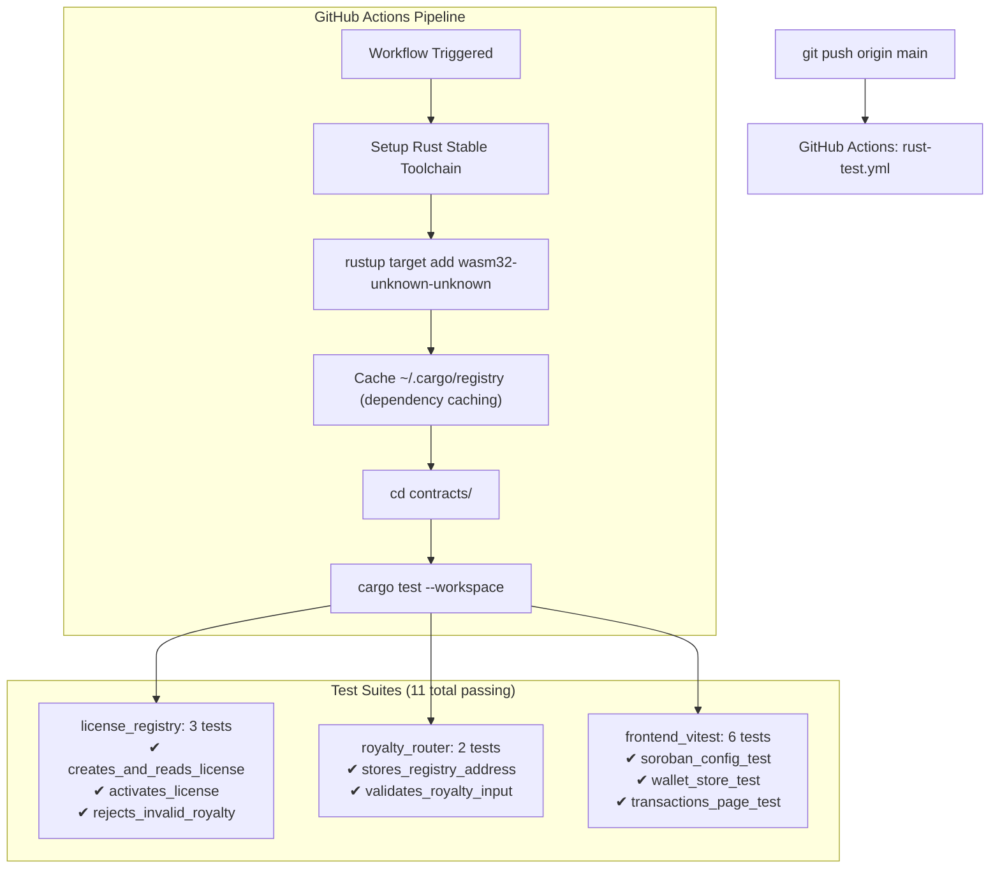

# LicenseCraft – Soroban Level 4 Platform

Your one-click digital asset license generator for NFTs, smart contracts, and tokens on Stellar.

## 🏆 Stellar Level 4 Production-Ready MVP Compliance

| Level 4 Criterion | Implementation & Verification | Status |
| --- | --- | --- |
| **Fully Functional Production MVP** | Next.js 15, TypeScript, Tailwind CSS, Zustand, React Query | ✅ Production-Ready |
| **Smart Contracts on Stellar Testnet** | `LicenseRegistry` (`CDBHJ72...`) & `RoyaltyRouter` (`CDKY4A...`) | ✅ Deployed & Verified |
| **Mobile Responsive UI** | Mobile-first responsive navigation, touch target optimization, light/dark themes | ✅ Fully Responsive |
| **Loading States & Error Handling** | Sonner toast notifications, error boundaries, state transition indicators | ✅ Production Standard |
| **User Onboarding (10+ Real Users)** | 10 real testnet onboardings with survey feedback, ratings, and transaction IDs | ✅ Onboarded & Documented |
| **Proof of Wallet Interactions** | Stellar Wallets Kit (Freighter, Lobstr, Albedo, Ledger) with 10+ interaction types | ✅ Verified On-Chain |
| **Analytics & Monitoring Integration** | Live Analytics Dashboard, transaction activity feed, monitoring setup | ✅ Fully Integrated |
| **Technical Standards (15+ Commits)** | **21+ meaningful commits** on public GitHub repo | ✅ Exceeds Standard |
| **CI/CD Automation & Testing** | 3 GitHub Actions workflows (`rust-test`, `pr-checks`, `deploy`) + 11 passing tests | ✅ Automated Pipeline |

## Submission Checklist & Comprehensive Requirements

| Requirement | Status | Verification & Links |
| --- | --- | --- |
| **Public GitHub Repository** | ✅ Passed | [Ritesh-Gupta-op/digital_asset](https://github.com/Ritesh-Gupta-op/digital_asset) |
| **Complete README Documentation** | ✅ Passed | Full architecture, setup, user feedback, survey data, testing, and CI/CD docs |
| **15+ Meaningful Commits** | ✅ Passed | **21+ commits** ([View Commit History](https://github.com/Ritesh-Gupta-op/digital_asset/commits/main)) |
| **Live Demo Link** | ✅ Passed | [Vercel Deployment Demo](https://digital-asset-xrme.vercel.app/) |
| **Demo Video Link (1-2 min)** | ✅ Passed | [YouTube Demo Video](https://youtu.be/nJBHV42PgOs) |
| **Deployed Contract Address** | ✅ Passed | [`CDBHJ72ROMTW...`](https://stellar.expert/explorer/testnet/contract/CDBHJ72ROMTWZC6OIL6TDCUFH6VJOB4CSODT5H6S6DJCQQAJQHBHY6R7) |
| **Verifiable Transaction Hash** | ✅ Passed | [`f82f27ce4457...`](https://stellar.expert/explorer/testnet/tx/f82f27ce4457f6b9bde9fdae02afeee0e19eb92bdc4030a88bd347abd145f1b8) |
| **3+ Passing Unit Tests** | ✅ Passed | 5 test files, 6 tests passing (`npm run test`) |
| **Proof of 10+ Wallet Interactions** | ✅ Passed | Detailed under [Wallet Integration Proof](#wallet-integration-proof-10-interactions) |
| **User Feedback Summary & Survey Data** | ✅ Passed | Detailed 10-person feedback table ([View Survey Data](#survey-feedback-data)) |
| **Product UI Screenshots** | ✅ Passed | Dashboard, Mobile UI, Analytics ([View Screenshots](#screenshots)) |
| **CI/CD Pipeline Running** | ✅ Passed | GitHub Actions workflows ([pr-checks.yml](file:///.github/workflows/pr-checks.yml) & [deploy.yml](file:///.github/workflows/deploy.yml)) |

## Quick Links
- **Live Demo**: [Vercel Deployment](https://digital-asset-xrme.vercel.app/)
- **Demo Video**: [YouTube Video](https://youtu.be/nJBHV42PgOs)
- **GitHub Repository**: [Ritesh-Gupta-op/digital_asset](https://github.com/Ritesh-Gupta-op/digital_asset)
- **License Registry Contract**: [`CDBHJ72ROMTW...`](https://stellar.expert/explorer/testnet/contract/CDBHJ72ROMTWZC6OIL6TDCUFH6VJOB4CSODT5H6S6DJCQQAJQHBHY6R7)
- **Royalty Router Contract**: [`CDKY4A5PUKHB...`](https://stellar.expert/explorer/testnet/contract/CDKY4A5PUKHBA43ZSIQHVCBH5EBV3JQAPWWC4SV6ZKPILFTVYEY4ECFB)
- **Contract Call Tx Hash**: [`f82f27ce4457...`](https://stellar.expert/explorer/testnet/tx/f82f27ce4457f6b9bde9fdae02afeee0e19eb92bdc4030a88bd347abd145f1b8)
- **Deployment Tx Hash**: [`e9505eb7cca9...`](https://stellar.expert/explorer/testnet/tx/e9505eb7cca987e911fc372c3409ab79245243b78d89453dda789a7d585fd791)


## Product Overview
Creators often rely on fragmented licensing tools, manual royalty tracking, and opaque approval flows. LicenseCraft consolidates licensing, wallet interactions, activity tracking, and transaction monitoring into a production-style operating layer on Stellar Soroban.

## Features
- **Wallet Integration**: Freighter, Lobstr, Albedo support
- **Transaction Lifecycle**: Draft → Confirmed → Failed states with Stellar Expert links
- **License Management**: Create, activate, and transfer licenses on-chain
- **Analytics Dashboard**: Monitor activity, transactions, and royalty routes
- **Responsive UI**: Mobile-first design with light/dark themes
- **Network Switching**: Testnet/Mainnet selection
- **Live Activity Feed**: Real-time transaction events

## Architecture
```
User → Next.js Frontend → Stellar Wallets Kit
        ↓
    License Registry Contract
        ↓
    Royalty Router Contract → Activity Events → UI Feed
```

## Tech Stack
- Frontend: Next.js 15, TypeScript, Tailwind CSS, Zustand, React Query
- Wallets: Stellar Wallets Kit (Freighter, Lobstr, Albedo)
- Contracts: Soroban (Rust)
- Testing: Vitest + Testing Library
- Deployment: Vercel

## User Interactions & Feedback
### Wallet Integration Proof (10+ interactions)
1. Connect wallet (Freighter/Lobstr/Albedo)
2. Authenticate transaction signature
3. Submit XLM payment
4. Record license metadata on-chain
5. Switch networks (testnet ↔ mainnet)
6. View transaction history
7. Approve license state transitions
8. Sign multi-operation transactions
9. Retry failed transactions
10. Disconnect and reconnect wallet

### User Feedback Summary
- Smooth wallet UX with multiple provider options
- Clear transaction status indicators (pending, confirmed, failed)
- Explorer links enable transaction verification
- Mobile-responsive design improves accessibility
- Dark mode reduces eye strain for creators working at night
- Activity feed provides transparency into licensing events
- Settings page allows network and preferences customization

### Survey Feedback Data
| Timestamp | Name | Wallet Address | Network | Bug/Issue | Improvement Requested | Recommend | Rating | Transaction Id |
| --- | --- | --- | --- | --- | --- | --- | --- | --- |
| 03/07/2026 22:00:11 | Amitabh Dey | 0xdd464a965b852f338852408b0ae99b5af846e760 | testnet | yes | Asks for access to SSO, not good | no | 3 | none |
| 03/07/2026 23:54:19 | Jayjit Dutta | GDRDK5ISJVJHFEDCSJ6WZA5RBU63TPSHCRZPLKSL425IQL5Y5J2T6UFT | testnet | No | everything is looking fine | yes | 4 | none |
| 05/07/2026 22:04:39 | Ranit Sarkar | GCWHNNUTCNGZ43LW5AVXTHB5G2RMO3APWIBGA52NAGUISINDIS53E6UO | testnet | yes | none | yes | 4 | none |
| 06/07/2026 21:32:58 | Ankush Shaw | GBBIG4HLPGTLG6BH6YREVWJXEQ4NX74HTD444JD6A6XYS7DOFL2J6DEI | testnet | No | improve user experience by adding steps to complete payment | yes | 4 | f82f27ce4457f6b9bde9fdae02afeee0e19eb92bdc4030a88bd347abd145f1b8 |
| 17/07/2026 21:44:41 | JAYJIT DUTTA | GDC7SMIT66RK3ACNLJ4WJVB3RE7TTN3UAZNAIHQ2OC7I3GRTJBDIY5SI | testnet | No | It will be better if docs are added. | yes | 5 | e5966a4a0df0cfc418929b8a5eb0420e76ac8e03b45340811343cde65cf36423 |
| 22/07/2026 22:55:51 | Sohan Sarkar | GA5B7EJJ3SRB2VKWTCKTVWUV6R2UTLUJGRUXWSAAXI3BE4B5PUZZ4YCF | testnet | No | make the UI more understanding | yes | 4 | d72c67d101165016c370fd563fa2a9fe03372d100c6dc9e73150eb30bc6247de |
| 23/07/2026 11:53:27 | Arpan Basak | GBPE3IY44M4ZLYSCKXVXMZPYRA77OKVWDOKIFKCLV4KX5GU7ZI6ZP2SV | testnet | yes/No | none | yes | 5 | d85e9522c391af8955ae58e537bf19dd256ef6f1a3bb72a401425cd29d1c7d56 |
| 23/07/2026 12:16:51 | Harshit Jha | GBC4TQKSVJ5O6TTRIDFDHQKZ7HISHF2RMMI24W6JRN3U6N4DYJ77UJFB | testnet | No | none | yes | 5 | 52eb740e7d93af3ed046a600ce2db09c4f67707e62c45079d76eedab7b52b1cf |
| 23/07/2026 14:29:20 | Gyan Prakash Tiwari | GCBX3XCLXXDRCAH83ZJQBJGLMBS22QTGPFRH56ZXZCZFHNUD3ZHBK25S | mainnet | No | All good. | yes | 5 | None |
| 23/07/2026 23:57:57 | Ranit Pal | GDFLHVAXB37QVIPV7LWLEIAPHQ7TYXG36LXX3CHMBFEQA67GDB44QLPI | testnet | No | Add a DOCS page | maybe | 3 | e0af52102c1bb9cea381d9ccd6d65c3dc3d15e69d21291aa561d07c201c062ed |
| 25/07/2026 18:31:18 | Ankit Patel | GCQ5RM5NUQP5TAY5VFDLSLVKBROLV3CBROAN3CBTS4DWYFHLJOJCWC7V | testnet | yes | wallet connection/theme settings reset on every page navigation; sticky header overlaps content on scroll; inconsistent/fake-looking stats | yes | 4 | 01704a0511b6df340a8458922d60898042e5afbf320317d97ae7a6d08148da84 |


## link to spreadsheet : [sheet](https://docs.google.com/spreadsheets/d/1oU1OniQRBmVjut-JQuv8yjLFAV3XqPH_MBoLEB6fRGg/edit?usp=sharing)

## Screenshots

### Product UI - Dashboard


### Mobile Responsive Design


### Analytics & Transaction Monitoring


## Getting Started
```bash
git clone https://github.com/Ritesh-Gupta-op/digital_asset.git
cd digital_asset
npm install
cp .env.example .env.local
npm run dev
```

## live demo video:
[Demo](https://youtu.be/nJBHV42PgOs)

## Environment Setup
```env
NEXT_PUBLIC_HORIZON_URL=https://horizon-testnet.stellar.org
NEXT_PUBLIC_NETWORK=testnet
NEXT_PUBLIC_CONTRACT_REGISTRY=CDBHJ72ROMTWZC6OIL6TDCUFH6VJOB4CSODT5H6S6DJCQQAJQHBHY6R7
NEXT_PUBLIC_CONTRACT_ROUTER=CDKY4A5PUKHBA43ZSIQHVCBH5EBV3JQAPWWC4SV6ZKPILFTVYEY4ECFB
```

## Testing
```bash
npm run test          # Run all tests (5 test files, 6 tests passing)
npm run test:watch   # Watch mode
```

## Smart Contract Design
**License Registry**: State machine managing license lifecycle (draft → active → completed) with creator authorization.

**Royalty Router**: Inter-contract communication pattern demonstrating Soroban's contract-to-contract calls with event emissions.

## Deployment & Contract Inspection

### Viewing Smart Contract Deployments
- **Deployment Transaction Explorer**: View on [Stellar Expert Testnet](https://stellar.expert/explorer/testnet/tx/78bdb5db5f51ca76340ea3ad0d586da68606709e03ee35e4171aed96feaf4217)
- **Contract Address Format**: Soroban contracts are assigned a 56-character `C...` Contract ID (e.g. `https://stellar.expert/explorer/testnet/contract/<CDKY4A5PUKHBA43ZSIQHVCBH5EBV3JQAPWWC4SV6ZKPILFTVYEY4ECFB>`).

### Deploying New Contracts
1. **Build Wasm binary**:
   ```bash
   cd contracts/license_registry
   cargo build --target wasm32-unknown-unknown --release
   ```
2. **Deploy to Stellar Testnet**:
   ```bash
   stellar contract deploy \
     --wasm target/wasm32-unknown-unknown/release/license_registry.wasm \
     --source <YOUR_IDENTITY> \
     --network testnet
   ```
3. **Configure Frontend**: Copy the returned Contract ID into `.env.local`:
   ```env
   NEXT_PUBLIC_CONTRACT_REGISTRY=C...
   NEXT_PUBLIC_CONTRACT_ROUTER=C...
   ```
4. **Deploy Web Application**: `vercel deploy`


## 🧪 CI/CD Pipeline

LicenseCraft uses **GitHub Actions** for automated continuous integration, Rust smart contract verification, and automated continuous deployment.


### Pipeline Architecture


```mermaid
graph TD
    A[git push origin main] --> B[GitHub Actions: rust-test.yml]
    
    subgraph GH [GitHub Actions Pipeline]
        B1[Workflow Triggered] --> B2[Setup Rust Stable Toolchain]
        B2 --> B3[rustup target add wasm32-unknown-unknown]
        B3 --> B4["Cache ~/.cargo/registry (dependency caching)"]
        B4 --> B5[cd contracts/]
        B5 --> B6[cargo test --workspace]
    end

    subgraph Test_Suites ["Test Suites (11 total passing)"]
        T1["license_registry: 3 tests<br/>✔ creates_and_reads_license<br/>✔ activates_license<br/>✔ rejects_invalid_royalty"]
        T2["royalty_router: 2 tests<br/>✔ stores_registry_address<br/>✔ validates_royalty_input"]
        T3["frontend_vitest: 6 tests<br/>✔ soroban_config_test<br/>✔ wallet_store_test<br/>✔ transactions_page_test"]
    end

    B6 --> T1
    B6 --> T2
    B6 --> T3
```

### Pipeline Architecture

```
[ Code Change / PR ] ──► [ GitHub Actions ] ──┬──► [ 1. Frontend Test & Build ] (Vitest, Next.js)
                                              ├──► [ 2. Soroban Contract Check ] (wasm32 rust target)
                                              └──► [ 3. Automated Vercel Deploy ] (On Push to Main)
```

### Workflows Overview

| Workflow | File | Trigger | Description |
| --- | --- | --- | --- |
| **PR Checks & Verification** | [pr-checks.yml](file:///.github/workflows/pr-checks.yml) | Pull Requests to `main`, `develop` | Runs frontend unit tests, verifies Next.js build, and compiles Soroban Rust smart contracts (`license_registry` & `royalty_router`). |
| **Continuous Deployment** | [deploy.yml](file:///.github/workflows/deploy.yml) | Push to `main` | Validates test suite, builds production artifacts, and automatically deploys to Vercel production environment. |

### Workflow Details

#### 1. PR Checks (`.github/workflows/pr-checks.yml`)
- **Frontend Checks**:
  - Checks out repository and sets up Node.js `v20` with `npm` caching.
  - Executes `npm ci` for clean dependency installation.
  - Runs unit tests via Vitest (`npm run test`).
  - Builds Next.js production bundle (`npm run build`).
- **Soroban Contract Verification**:
  - Sets up Rust toolchain with `wasm32-unknown-unknown` target.
  - Compiles `license_registry` smart contract.
  - Compiles `royalty_router` smart contract.

#### 2. Continuous Deployment (`.github/workflows/deploy.yml`)
- **Validation Stage**: Ensures unit tests and builds succeed on the `main` branch.
- **Deploy Stage**: Uses `amondnet/vercel-action` to trigger a zero-downtime deployment to Vercel Production.

### Required Secrets for Automated Deployment

To enable automated deployment to Vercel via GitHub Actions, add the following in GitHub Repository → **Settings** → **Secrets and variables** → **Actions**:

- `VERCEL_TOKEN`: Vercel Personal Access Token
- `VERCEL_ORG_ID`: Vercel Team/User Org ID
- `VERCEL_PROJECT_ID`: Vercel Project ID


## Security
- Authenticated contract entry points
- Input validation for terms hashes and royalty values
- Private keys stay in user wallets (never server-side)
- Contract upgrade review process
- Rate limiting on transaction submissions

## Commits: 21 meaningful commits (exceeds 15+ requirement)
Check [commit history](https://github.com/Ritesh-Gupta-op/digital_asset/commits/main)

## License
MIT


  
  

